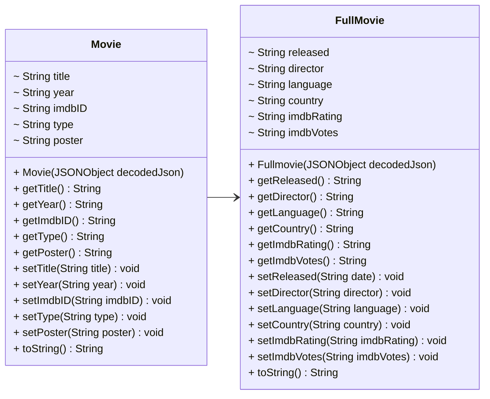

# Idea

Here is the UML that represents the Hierarchy of classes we chose:

```mermaid
classDiagram
    direction LR
    class `Movie`
    class `FullMovie`
    `Movie` --> `FullMovie`
    Movie : ~ String title
    Movie : ~ String year
    Movie : ~ String imdbID
    Movie : ~ String type
    Movie : ~ String poster
    Movie : + Movie(JSONObject decodedJson)
    Movie : + getTitle() String
    Movie : + getYear() String
    Movie : + getImdbID() String
    Movie : + getType() String
    Movie : + getPoster() String
    Movie : + setTitle(String title) void
    Movie : + setYear(String year) void
    Movie : + setImdbID(String imdbID) void
    Movie : + setType(String type) void
    Movie : + setPoster(String poster) void
    Movie : + toString() String

    FullMovie : ~ String released
    FullMovie : ~ String director
    FullMovie : ~ String language
    FullMovie : ~ String country
    FullMovie : ~ String imdbRating
    FullMovie : ~ String imdbVotes
    FullMovie : + Fullmovie(JSONObject decodedJson)
    FullMovie : + getReleased() String
    FullMovie : + getDirector() String
    FullMovie : + getLanguage() String
    FullMovie : + getCountry() String
    FullMovie : + getImdbRating() String
    FullMovie : + getImdbVotes() String
    FullMovie : + setReleased(String date) void
    FullMovie : + setDirector(String director) void
    FullMovie : + setLanguage(String language) void
    FullMovie : + setCountry(String country) void
    FullMovie : + setImdbRating(String imdbRating) void
    FullMovie : + setImdbVotes(String imdbVotes) void
    FullMovie : + toString() String
```

