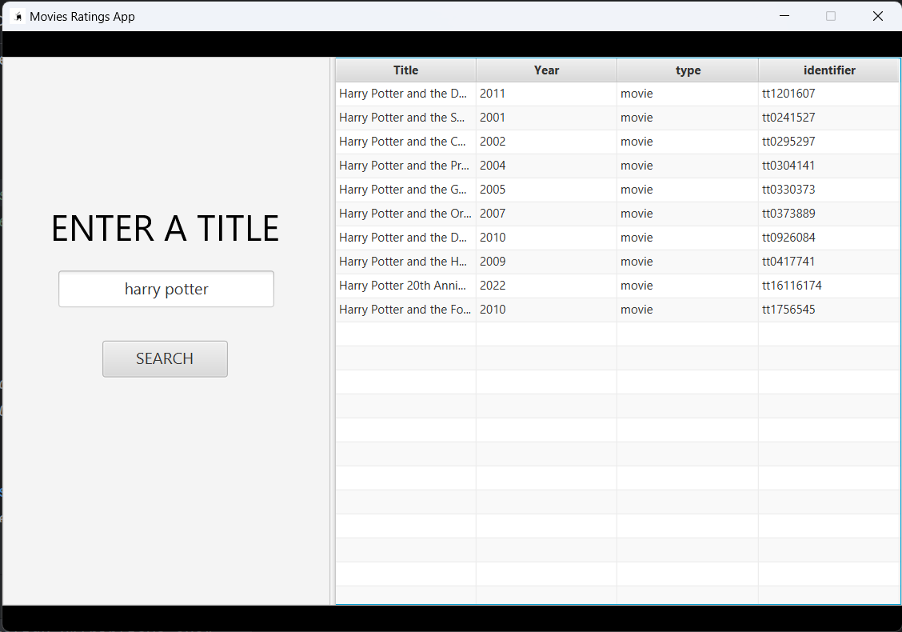
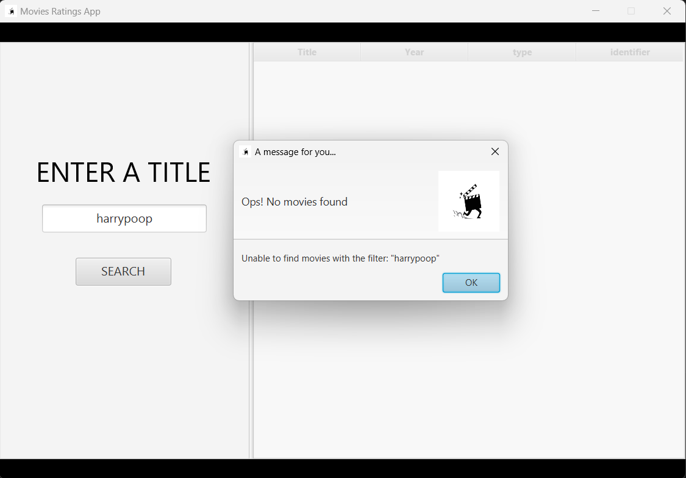

# Idea 💡

Let us suppose you want to watch a Harry Potter's movie. Of course you do not care about the storyline, 
you just want to see the most rated movie of the saga. Well, we are here to give you the solution!
Our app allows you to compare the imdb ratings and metascore's ratings of plenty of movies!

How does it work? Let's see...
  

  
As soon as the application starts, you will face this window. Here you can type a string in the search field, and after clicking on the <b>"SEARCH"</b> button the software will send an HTTP request to the an online database ([OMDb](https://www.omdbapi.com/)). 
Once the request has been sent, the application will handle the response, gathering all the movies that match your query. The results will be shown in the table on the right, as you can see below:
  

  
But there's a problem... where are the ratings? Keep calm! 
Just click on the movie you want to analyze and we are done!
  

Of course, you can open the details of more than one movie at a time, so that you can compare their ratings!

If you are searching a very rare movie, which is not stored in the online database, the app will inform you that it is unable to retrieve it, as follows:
  

  
Let's see how we developed this! (And remember, do not waste time watching such movies as Harry Potter's...)

---

### Jump to next section → [1-GetStarted](1-GetStarted.md)