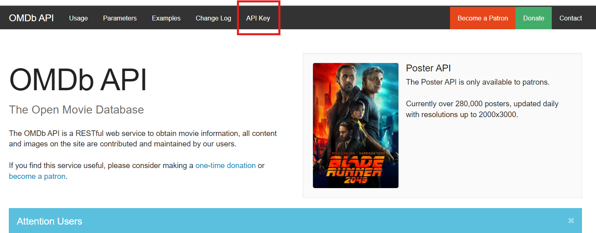
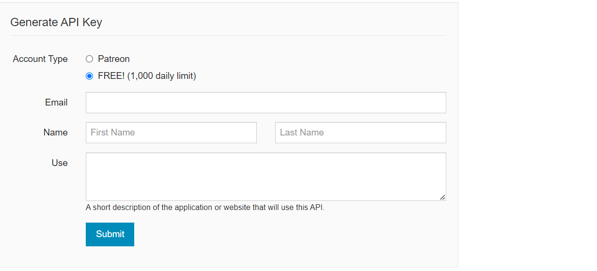

# Get started

Such as with every other RESTful API, our program needs an API Key, an alphanumeric string that API’s developers use to filter accesses to their services.
Let’s move to the IMDb API web page: https://www.omdbapi.com/

Click on the “API Key” section inside the navbar.



Choose the “FREE! (1,000 daily limit)” option and fill the form. It is required to fill all the shown fields.



After submitting your answers, you’ll receive an email at the provided address which contains your newly generated API Key, together with a link to activate your Key. Click on that link and we’re done.

## We’re now allowed to interact with the online database!

Try pasting the following link on your browser substituting `[mykey]` with the Key received by e-mail.

`http://www.omdbapi.com/?apikey=[mykey]&t=batman`

If everything has worked correctly, you will see a JSON structure containing information about the film "Batman" from 1989.

## One last thing...

Due to security reasons, we have decided not to share our personal OMDb API key. 
Therefore, if you got your key by following the previous steps, you need to copy your key in the following
constructor, located in the `MovieController.java` file (see [4-Controllers](4-Controllers.md))

```java
    private final HttpHandler handler = new HttpHandler("Write your API key here!");  
```
This last passage is absolutely necessary: if you skip it, the project will not work!

---

### Jump to next section → [2-Models](2-Models.md)