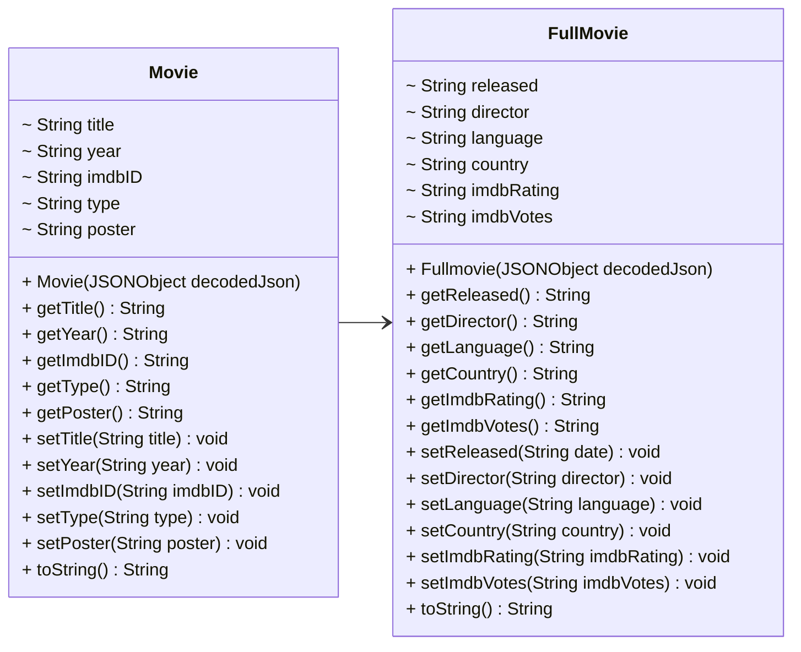

# MODELS 🎥
To represent the movies/TV series/videogames received by the OMDb database, we decided to create two classes.
Here is the UML that represents the hierarchy:



Translated into Java language, the definition of the classes is the following(methods are momentarily neglected):

* `Movie`

```java
public class Movie {
    public String title = "N/A";
    public String year = "N/A";
    public String imdbID = "N/A";
    public String type = "N/A";
    public String poster = "N/A";
}
```

* `FullMovie` (which inherits from `Movie`)
  
```java
public final class Fullmovie extends Movie{

    --> adjust the javadoc part
    /*
    *   title, year, poster, type and imdbID are 
    *   inherited from the Movie class
    * */
    private String rated = "N/A";
    private String released = "N/A";
    private String runtime  = "N/A";
    private String genre = "N/A";
    private String director = "N/A";
    private String writer = "N/A";
    private String actors = "N/A";
    private String plot = "N/A";
    private String language = "N/A";
    private String country = "N/A";
    private String awards = "N/A";
    private String metascore = "N/A";
    private String imdbRating = "N/A";
    private String imdbVotes = "N/A";
    private boolean response = false;
}
```

The division into two classes is due to the fact that the quantity of information retrieved depends on the search parameter. A request for a single item(by `imdbID`) returns all its details, unlike a request for multiple items(by `title`), which provides only essential information(`title`, `year`, `type`,`imdbID` and `poster`).

Therefore, the `Movie` class models the movie objects retrieved from a simple request filtered by a string, which returns a list of movies whose titles contain the string.
The `FullMovie` class models the FullMovie object retrieved from a detailed request filtered by the movie's imdbID.

##

We will not waste any time talking about setters, getters and toString(), you can easily generate them through your IDE.
What is worth to discuss about are the constructors of the two classes' instances.
Since OMDb answers to our HTTP requests through JSON objects, we need something to "unwrap" the information received.
Here comes to help the `json.simple` class to easily obtain information from a JSON object.
Let's see our constructors:

```java
```


##

### Jump to next section -> [3-HTTPHandler](3-HttpHandler.md)

##