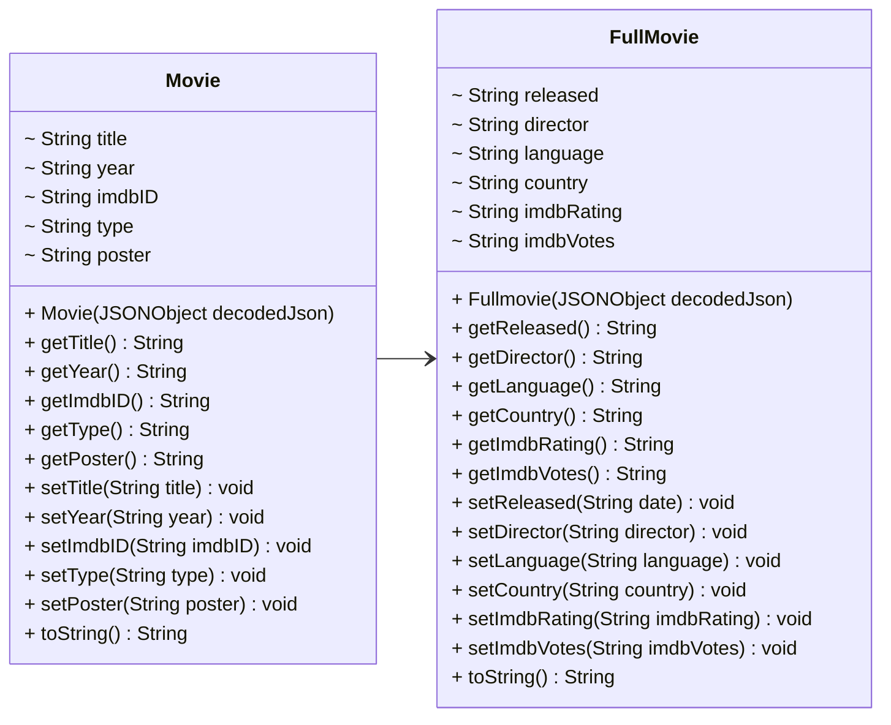

# MODELS 🎥
To represent the movies/TV series/videogames received by the OMDb database, we decided to create two classes.
Here is the UML that represents the hierarchy:



Translated into Java language, the definition of the classes is the following(methods are momentarily neglected):

* `Movie`

```java
public class Movie {
    /** the movie's title. */
    public String title = "N/A";
    /** the movie's year. */
    public String year = "N/A";
    /** the movie's identifier. */
    public String imdbID = "N/A";
    /** the movie's type. */
    public String type = "N/A";
    /** the movie's poster. */
    public String poster = "N/A";
}
```

* `FullMovie` (which inherits from `Movie`)
  
```java
public final class Fullmovie extends Movie{

     /** The movie's runtime. */
    private String runtime = "N/A";
    /** The movie's genre. */
    private String genre = "N/A";
    /** The movie's director. */
    private String director = "N/A";
    /** The movie's language. */
    private String language = "N/A";
    /** The movie's country. */
    private String country = "N/A";
    /** The movie's metascore. */
    private String metascore = "N/A";
    /** The movie's IMDb rating. */
    private String imdbRating = "N/A";
    /** The request's response. */
    private boolean response = false;
}
```

The division into two classes is due to the fact that the quantity of information retrieved depends on the query parameter.

Therefore, the `Movie` class models the movie objects retrieved from a simple request filtered by a string, which returns a list of movies whose titles contain the string. It provides only essential information for each Movie (`title`, `year`, `type`,`imdbID` and `poster`).
The `FullMovie` class models the FullMovie object retrieved from a detailed request, filtered by the movie's imdbID. This request returns a single FullMovie Object, with several additional fields.

---

We will not waste any time talking about setters, getters and toString(), you can easily generate them through your IDE.
What is worth to discuss about are the constructors.
Since OMDb responds to our HTTP requests with JSON objects, we need something to "unwrap" the information received.
Here it comes the help of `json.simple` class to easily obtain information from a `JSON object`.

A `JSON object` contains a set of key-value pairs of data.

Let us take a look at the constructors:

```java
public Movie(JSONObject decodedJson){
        setTitle((String)decodedJson.get("Title"));
        setYear((String)decodedJson.get("Year"));
        setImdbID((String)decodedJson.get("imdbID"));
        setType((String)decodedJson.get("Type"));
        setPoster((String)decodedJson.get("Poster"));
    }
```

JSONSimple provides us the `get()` method to retrieve a value by its key. Then we assign that value to the class attribute.

```java
public FullMovie(JSONObject decodedJson){
        super(decodedJson);
        if(decodedJson.get("Response").equals("false")){
            System.out.println("The movie does not exist");
        } else{
            setRuntime(decodedJson.get("Runtime").toString());
            setGenre(decodedJson.get("Genre").toString());
            setDirector(decodedJson.get("Director").toString());
            setLanguage(decodedJson.get("Language").toString());
            setCountry(decodedJson.get("Country").toString());
            setMetascore(decodedJson.get("Metascore").toString());
            setImdbRating(decodedJson.get("imdbRating").toString());
        }
        setResponse((String)decodedJson.get("Response"));
    }
```
The `FullMovie` constructor works the same as the `Movie` constructor, but it also needs to check the response field.

The Movie constructor does not check a response variable because a Movie is always retrieved from a simple filtered request for multiple items. Thus, the boolean value is checked in `HttpHandler.filteredRequest()` method, as we will see in the next section.

---

### Jump to next section → [3-HttpHandler](3-HttpHandler.md)
### [1-GetStarted](1-GetStarted.md) ← Jump to previous section