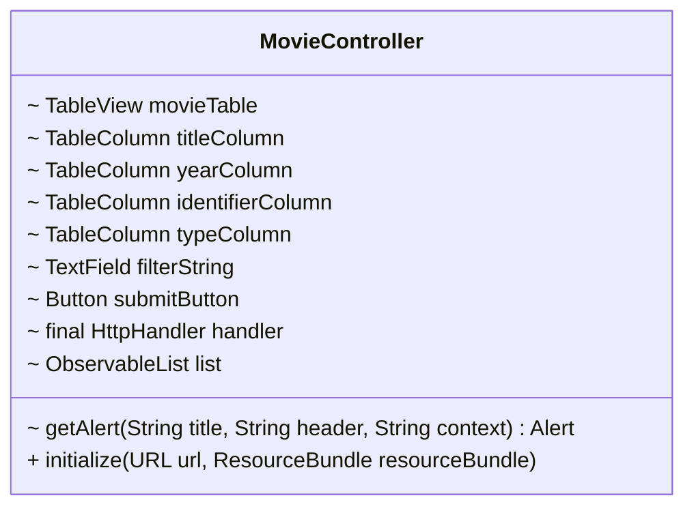
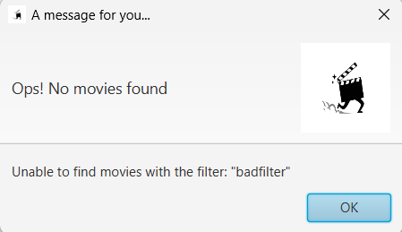
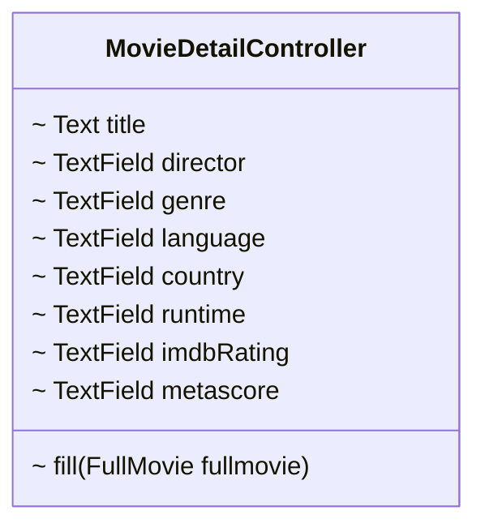
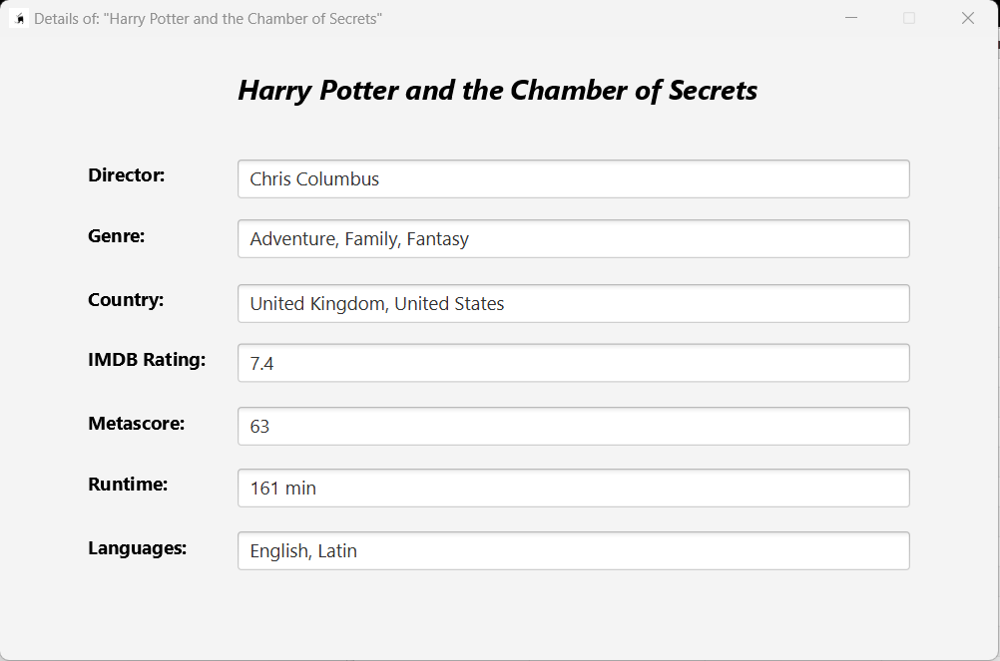

# 4-CONTROLLERS 🎮

The heart of the projects are the controllers.
Controllers are used as intermediary between the user interface and the application features.
Each controller is associated to the fxml file that implements the graphics.
The fxml files have been created using the [SceneBuilder tool.](https://gluonhq.com/products/scene-builder/)

As we have already covered, there are two possible kind of request. 
For each type of request, there is a different way to visualize the data.

In the case of the simple filtered request (by string), the movies are displayed through a table.
The controller related to this window must handle the textfield that allows the user to enter the title, and the button that sends the request. Let's take a look at the `MovieController` first.

Here is the UML of the class:



The attributes model the graphical elements in the window (stage) associated to the controller.
In this case the FXML file is `movie-view.fxml`.

The `HttpHandler handler` attribute is used to set up an instance of the [HTTP handler](3-HttpHandler.md) class.<br/>
We will pass the API key as a parameter to its constructor.
The instance methods of the `HttpHandler` class will be used to manage the requests that will be made by the user's events (clicking the button or clicking a table row).

After a simple filtered request, which is sent when the user presses the button <b>"SEARCH"</b>,
the `ObservableList<Movie> list` will be filled with a list of `Movie` objects, that are retrieved from the JSON response using the `handler` attribute and the `Movie` constructor.
The movies stored in the observable list are shown in the table.

Let us now discuss the Initialize Method.

>### <i>The initialize method is automatically called after the FXML elements are loaded, but before the UI is displayed. It is commonly used to setup initial values or properties components, establish data structures, and add listeners to components.</i>

<br>

```java
public void initialize(URL url, ResourceBundle resourceBundle) {
    titleColumn.setCellValueFactory(new PropertyValueFactory<>("title"));
    yearColumn.setCellValueFactory(new PropertyValueFactory<>("year"));
    identifierColumn.setCellValueFactory(new PropertyValueFactory<>("imdbID"));
    typeColumn.setCellValueFactory(new PropertyValueFactory<>("type"));

    submitButton.setOnMouseClicked(mouseEvent -> {
        String filter = filterString.getText().trim();
        if(filter.isEmpty())
            return;
        list = FXCollections.observableArrayList(handler.filteredRequest(filter));
        if(list.isEmpty()){
            Alert alert = getAlert("A message for you...",
                    "Ops! No movies found",
                    "Unable to find movies with the filter: " + "\"" + filterString.getText() + "\"");
            alert.showAndWait();
            movieTable.setDisable(true);
        } else
            movieTable.setDisable(false);
        movieTable.setItems(list);
    });
    movieTable.setOnMouseClicked(mouseEvent -> {
        Movie selectedMovie = movieTable.getSelectionModel().getSelectedItem();
        if(Objects.isNull(selectedMovie))
            return;
        FullMovie requestedMovie = handler.fullMovieRequest(selectedMovie.getImdbID());
        try{
            FXMLLoader fxmlLoader = new FXMLLoader(App.class.getResource("movie-detail.fxml"));
            Parent root = fxmlLoader.load();
            Stage newStage = new Stage();
            newStage.setTitle("Details of: \"" + selectedMovie.getTitle() + "\"");
            newStage.setScene(new Scene(root));
            newStage.getIcons().add(new Image(Objects.requireNonNull(App.class.getResourceAsStream("images/icon.png"))));
            newStage.setResizable(false);
            newStage.show();
            MovieDetailController controller = fxmlLoader.getController();
            controller.fill(requestedMovie);
            movieTable.getSelectionModel().clearSelection();
        }catch(Exception e){
            Alert alert = getAlert("Error Dialog",
                    null,
                    "An error occurred while trying to display the movie details.");
            alert.showAndWait();
        }
    });
}
```

The first four lines are used to associate the `MovieController` attributes to the elements of the stage. 

Since we just need to handle a couple of events, we decided to define the event handlers inside the
`initialize()` method using lambda expressions.

Let us take a deeper look to the the lambdas.

---

### Search button onClick event

```java
    submitButton.setOnMouseClicked(mouseEvent -> {
        String filter = filterString.getText().trim(); // Trimming the filter string!
        if(filter.isEmpty()) // Nothing happens!
            return;
        // Let's now fill the observable list!
        list = FXCollections.observableArrayList(handler.filteredRequest(filter)); 
        // If not film is found...
        if(list.isEmpty()){
            // Informing the user with an alert!
            Alert alert = getAlert("A message for you...",
                    "Ops! No movies found",
                    "Unable to find movies with the filter: " + "\"" + filterString.getText() + "\"");
            alert.showAndWait();
            movieTable.setDisable(true); // Table is disabled when the list is empty!
        } else
            movieTable.setDisable(false); // If at list a film is found, the table is clickable!

        movieTable.setItems(list);        // The movie table is updated with the new data!
    });
```
If the trimmed filter string is empty, nothing happens, since a return statement is executed.
Otherwise, this event causes the application to send a simple string-filtered request by title to the OMDb database. <br/>

It returns an ArrayList of JSON Objects, then parsed to an ArrayList of Movies (through the HTTP handler) and then it fills the Observable List, displaying the data in the table.
In the case the list is empty, thus the filter did not match any movie, an Alert object is istantiated using the `getAlert()` utility method and the table is disabled (not clickable anymore).
<br/>
```java
private Alert getAlert(String title, String header, String content){
    // Creating the alert!
    Alert alert = new Alert(Alert.AlertType.ERROR);
    alert.setTitle(title);
    alert.setHeaderText(header);
    alert.setContentText(content);

    // Setting the alert icon!
    Stage alertStage = (Stage) alert.getDialogPane().getScene().getWindow();
    Image icon = new Image(Objects.requireNonNull(App.class.getResourceAsStream("images/icon.png")));
    alertStage.getIcons().add(icon);
    ImageView imageView = new ImageView(icon);
    imageView.setFitHeight(80);
    imageView.setFitWidth(80);
    alert.setGraphic(imageView);
    return alert;
}
```

As seen in [0-Idea](0-Idea.md), the alert looks like this:



---

### Movie detail onClick event

If the table is non-empty, and thus clickable, the user can select a row (movie) and click on it
to retrieve the details. This causes the HTTP handler to call the `FullMovieRequest()`, using
the imdbID of the selected row as a query parameter for the request.

```java
    movieTable.setOnMouseClicked(mouseEvent -> {
        Movie selectedMovie = movieTable.getSelectionModel().getSelectedItem();
        if(Objects.isNull(selectedMovie)) // Nothing happens!
            return;
        // The detailed request is sent by the HTTP handler!
        FullMovie requestedMovie = handler.fullMovieRequest(selectedMovie.getImdbID());
        try{
            // We create the new stage window!
            FXMLLoader fxmlLoader = new FXMLLoader(App.class.getResource("movie-detail.fxml"));
            Parent root = fxmlLoader.load();
            Stage newStage = new Stage();
            newStage.setTitle("Details of: \"" + selectedMovie.getTitle() + "\"");
            newStage.setScene(new Scene(root));
            newStage.getIcons().add(new Image(Objects.requireNonNull(App.class.getResourceAsStream("images/icon.png"))));
            newStage.setResizable(false);
            newStage.show();
            // We get the controller of the new stage!
            MovieDetailController controller = fxmlLoader.getController();
            // We fills the detail view with the retrieved data!
            controller.fill(requestedMovie);                   
            movieTable.getSelectionModel().clearSelection();
        }catch(Exception e){
            // If something goes wrong, we inform the user!
            Alert alert = getAlert("Error Dialog",
                    null,
                    "An error occurred while trying to display the movie details.");
            alert.showAndWait();
        }
    });
```
It behaves the same as the previous event at the beginning: if the `FullMovie` object is null,
then nothing happens. Otherwise, the request is performed by the handler, using the selected table row. If something goes wrong, we inform the user with an alert.
Then the hard part comes. 

A new stage is istantiated using `movie-detail.fxml`.

```java
            FXMLLoader fxmlLoader = new FXMLLoader(App.class.getResource("movie-detail.fxml"));
            Parent root = fxmlLoader.load();
            Stage newStage = new Stage();
```
Now, the issue is to find a way to make the two controllers to communicate between each other, since
the `MovieDetailController` needs the data from the `FullMovie` object that has been created inside the `MovieController`. In order to tackle the problem, we retrieved the `MovieDetailController` using the `fxmlLoader.getController()` istance method.

```java
            MovieDetailController controller = fxmlLoader.getController();
```

In conclusion, we call the `controller.fill()`, a `MovieDetailController` instance method to fill the
new stage textfields.

```java
            controller.fill(requestedMovie); 
```

Let's finally take a look at the second controller:



The attributes model the title and seven texfields showing the movie's details.
As we have covered in [2-models](2-Models.md), the new detailed stage looks like this:



In the end, this is the fill method which is called inside the `MovieController` when the user click on a movie in the table to show further details.

```java
public void fill(FullMovie fullMovie) {
    this.title.setText(fullMovie.getTitle());
    this.director.setText(fullMovie.getDirector());
    this.genre.setText(fullMovie.getGenre());
    this.language.setText(fullMovie.getLanguage());
    this.country.setText(fullMovie.getCountry());
    this.runtime.setText(fullMovie.getRuntime());
    this.imdbRating.setText(fullMovie.getImdbRating());
    this.metascore.setText(fullMovie.getMetascore());
}
```

---

### [3-HttpHandler](3-HttpHandler.md) ← Jump to previous section

---

### And that's all! 
Thanks for reading! Hope you don't like Harry Potter!!!

